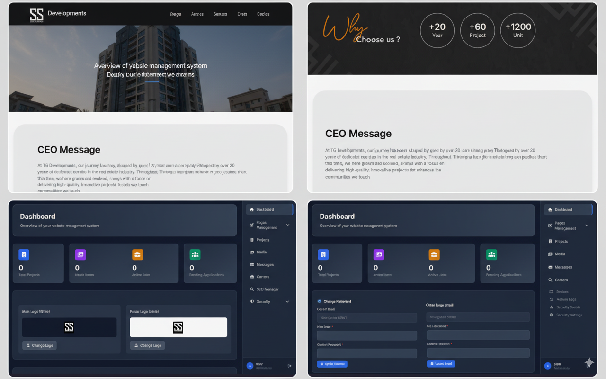

# C-Project

A comprehensive real estate platform with a modern CMS system built using Laravel, featuring both Arabic and English language support.



## 📝 License

```
MIT License

Copyright (c) 2025 SlowWebDev

Permission is hereby granted, free of charge, to any person obtaining a copy
of this software and associated documentation files (the "Software"), to deal
in the Software without restriction, including without limitation the rights
to use, copy, modify, merge, publish, distribute, sublicense, and/or sell
copies of the Software, and to permit persons to whom the Software is
furnished to do so, subject to the following conditions:

The above copyright notice and this permission notice shall be included in all
copies or substantial portions of the Software.

THE SOFTWARE IS PROVIDED "AS IS", WITHOUT WARRANTY OF ANY KIND, EXPRESS OR
IMPLIED, INCLUDING BUT NOT LIMITED TO THE WARRANTIES OF MERCHANTABILITY,
FITNESS FOR A PARTICULAR PURPOSE AND NONINFRINGEMENT. IN NO EVENT SHALL THE
AUTHORS OR COPYRIGHT HOLDERS BE LIABLE FOR ANY CLAIM, DAMAGES OR OTHER
LIABILITY, WHETHER IN AN ACTION OF CONTRACT, TORT OR OTHERWISE, ARISING FROM,
OUT OF OR IN CONNECTION WITH THE SOFTWARE OR THE USE OR OTHER DEALINGS IN THE
SOFTWARE.
```

## 🏢 About The Project

C-Project is a full-featured real estate management system that includes:
- Modern property listings and management
- Advanced CMS for content management
- Career portal with job listings and applications
- Media center for news and updates
- Dynamic settings management
- SEO optimization tools

## ✨ Key Features

- **Property Management**
  - Detailed property listings
  - Project categories and filtering
  - Image galleries and virtual tours

- **Admin Dashboard**
  - User-friendly CMS interface
  - Content management tools
  - SEO management
  - Settings control panel

- **Career Portal**
  - Job listings management
  - Application handling
  - Candidate tracking

- **Media Center**
  - News and updates
  - Press releases
  - Media gallery

## 🛠 Built With

- Laravel
- MySQL
- Redis
- Tailwind CSS
- Alpine.js
- Laravel Mix
- PHP 8.1+

## 📋 Prerequisites

- PHP >= 8.1
- Composer
- Node.js & NPM
- MySQL
- Redis

## 🚀 Installation

1. Clone the repository
```bash
git clone https://github.com/SlowWebDev/C-project.git
```

2. Install PHP dependencies
```bash
composer install
```

3. Install NPM packages
```bash
npm install
```

4. Copy environment file
```bash
cp .env.example .env
```

5. Generate application key
```bash
php artisan key:generate
```

6. Configure database in .env file
```
DB_CONNECTION=mysql
DB_HOST=127.0.0.1
DB_PORT=3306
DB_DATABASE=your_database
DB_USERNAME=your_username
DB_PASSWORD=your_password
```

7. Run migrations
```bash
php artisan migrate
```

8. Build assets
```bash
npm run build
```

9. Start the development server
```bash
php artisan serve
```

## 🔧 Configuration

1. Configure Redis in .env:
```
REDIS_HOST=127.0.0.1
REDIS_PASSWORD=null
REDIS_PORT=6379
```

2. Configure mail settings in .env for contact forms:
```
MAIL_MAILER=smtp
MAIL_HOST=your_mail_host
MAIL_PORT=587
MAIL_USERNAME=your_username
MAIL_PASSWORD=your_password
MAIL_ENCRYPTION=tls
```

## 📱 Features

### Frontend
- Responsive design
- Property search and filtering
- Career opportunities
- Contact forms
- News and media section
- Multilingual support (Arabic/English)

### Admin Panel
- Dashboard with statistics
- Project management
- Job listings management
- Media management
- SEO tools
- Settings management
- Security features

## 🔐 Security Features

- Two-factor authentication
- Role-based access control
- Activity logging
- Security event tracking
- Rate limiting on forms

## 🌐 Browser Support

- Chrome (latest)
- Firefox (latest)
- Safari (latest)
- Edge (latest)

## 📜 License

This project is proprietary software. All rights reserved.

## 📧 Contact & Support

### Discord
For quick support and community discussions, join us on Discord:
- Discord Username: **1slow**

### Other Channels
- Report issues through [GitHub Issues](https://github.com/SlowWebDev/C-project/issues)
- Send feature requests through Discord

## 🤝 Contributing

1. Fork the Project
2. Create your Feature Branch (`git checkout -b feature/AmazingFeature`)
3. Commit your Changes (`git commit -m 'Add some AmazingFeature'`)
4. Push to the Branch (`git push origin feature/AmazingFeature`)
5. Open a Pull Request

## 📜 View Full License

To view the complete license in both English and Arabic, check the [LICENSE](LICENSE) file in the repository.

---

Made with ❤️ by [SlowWebDev](https://github.com/SlowWebDev)
